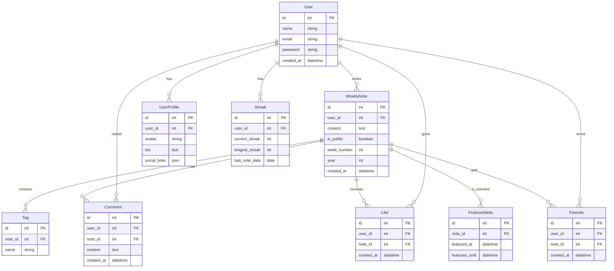

# 周一记

## 项目背景

- 用户每周需完成一篇周记
- 周记内容支持 markdown 格式
- 周记内可以通过 #标签 来打标签
- 周记内容可以选择是否公开
- 公开周记可以被其他用户查看和评论
- 公开周记可以被点赞和收藏
- 每周会有精选周记，被推荐到首页
- 周记每周有提醒编写功能
- 周记有连续打卡排行榜，根据每周是否完成周记来计算
- 用户可以编辑完善个人资料

## 技术栈

- php
- laravel 11
- sqlite
- tailwindcss
- inertiajs
- vue3
- typescript

## 系统架构图

这个架构图展示了系统的主要实体和它们之间的关系：

1. **用户(User)** 是系统的核心实体，可以：
   - 编写周记
   - 发表评论
   - 点赞和收藏
   - 维护个人资料

2. **周记(WeeklyNote)** 是主要内容实体：
   - 包含 markdown 内容
   - 可以设置公开/私密
   - 可以添加标签
   - 可以被评论、点赞和收藏
   - 可以被设为精选

3. **标签(Tag)** 用于分类周记

4. **用户资料(UserProfile)** 存储用户的详细信息

5. **连续打卡(Streak)** 记录用户的周记完成情况

6. **精选周记(FeaturedNote)** 管理首页推荐的周记

这个架构设计支持了所有项目需求中提到的功能，并且保持了良好的扩展性。